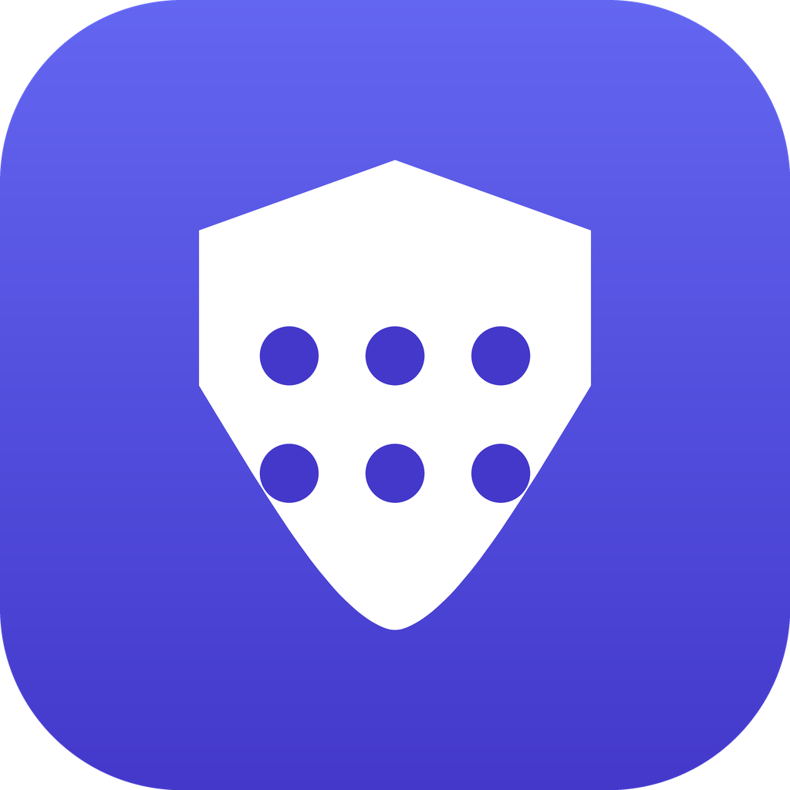
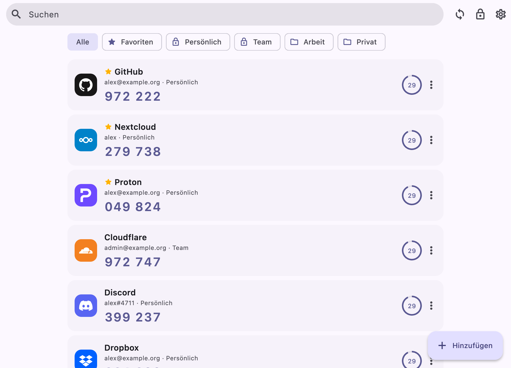
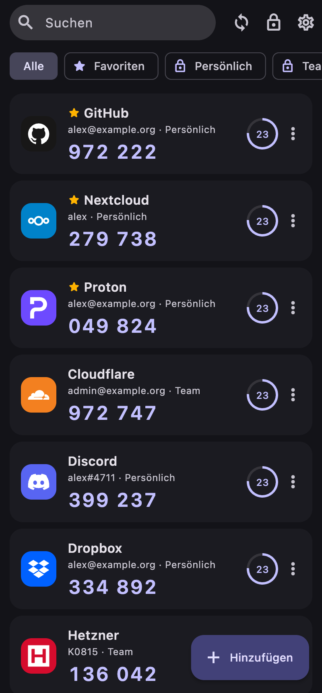
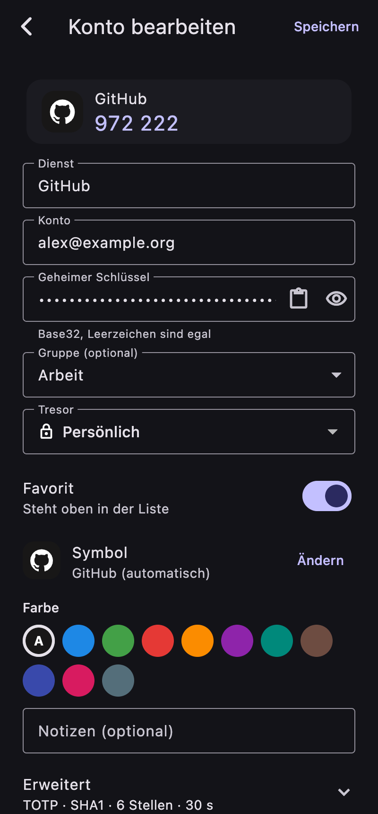

# Sixora

<p align="center">
  
</p>

<p align="center">
  Einmal-Codes für die Zwei-Faktor-Anmeldung auf dem eigenen Server –
  Ende-zu-Ende verschlüsselt, offline nutzbar, auf allen Geräten.
</p>

Sixora verwaltet Einmal-Codes für die Zwei-Faktor-Anmeldung (TOTP/HOTP) auf
einem eigenen Server. Die Apps gibt es für Android, iOS, macOS, Windows und
Linux. Die Codes entstehen auf den Geräten. Der Server speichert nur
verschlüsselte Daten und kann kein Geheimnis lesen, auch nicht der
Administrator.

Der Quellcode ist einsehbar, aber **nicht Open Source**: Der Projektcode
steht unter der [PolyForm Strict License 1.0.0](LICENSE) (© 2026 Dasevo
Digital und superkuh). Erlaubt sind die nichtkommerzielle Nutzung und das
Prüfen des Quellcodes. Kopieren, Ändern, Weitergeben und jede kommerzielle
Nutzung sind ohne gesonderte schriftliche Genehmigung nicht gestattet.
Hinweise zu Komponenten und Daten Dritter stehen in
[THIRD_PARTY_NOTICES.md](THIRD_PARTY_NOTICES.md).

## Ein Blick in Sixora

<p align="center">
  
  
  
</p>

*Die Screenshots zeigen ausgedachte Demo-Konten (`tool/screenshots.sh`).*

## Herunterladen

Die fertigen Apps und das Server-Paket liegen bei den
[Releases](../../releases/latest):

| Datei | Für |
|---|---|
| `Sixora-<version>-android-arm64.apk` | Android 7 und neuer, fast alle Geräte (`-armv7` für sehr alte, `-x86_64` für Emulatoren) |
| `Sixora-<version>-macOS.zip` | macOS 12 und neuer, Apple Silicon und Intel |
| `Sixora-<version>-windows-x64.zip` | Windows 10 und 11 (entpacken, `sixora.exe` starten) |
| `Sixora-<version>-linux-x64.tar.gz` | Linux x86_64 mit GTK 3 und einem Secret-Service (GNOME Keyring, KWallet) |
| `sixora-server-<version>-linux-<arch>.tar.gz` | Server ohne Docker, siehe [unten](#ohne-docker-proxmox-lxc-oder-debian) |

Die Builds sind nicht von Apple oder Microsoft beglaubigt. macOS öffnet die
App beim ersten Mal nur über Rechtsklick → *Öffnen*, Windows fragt über
SmartScreen nach (*Weitere Informationen* → *Trotzdem ausführen*). Für
iPhone und iPad gibt es noch keinen Download; dort lässt sich Sixora mit
Xcode aus dem Quellcode installieren. `SHA256SUMS.txt` im Release enthält
die Prüfsummen aller Dateien.

## Funktionen

- **Codes:** TOTP (SHA-1/256/512, 4–10 Stellen, beliebiges Intervall), HOTP
  mit Zähler, Steam Guard. Countdown, Vorschau auf den nächsten Code, Kopieren
  per Tippen; die Zwischenablage wird nach 30 s geleert.
- **Hinzufügen:** QR-Code mit der Kamera (Android, iOS, macOS), QR-Code aus
  einem Bild oder Screenshot (alle Plattformen), `otpauth://`-Link aus der
  Zwischenablage oder Eingabe von Hand.
- **Logos:** Bekannte Dienste zeigen ihr Logo, erkannt am Namen; eigenes
  Logo oder Anfangsbuchstabe lassen sich wählen. Die rund 3.300 Logos aus
  [Simple Icons](https://simpleicons.org) sind in die App eingebaut, es gibt
  keine Abrufe bei Dritten (`app/tool/update_service_icons.py`). Einige
  Marken, etwa Microsoft oder Amazon, haben ihre Logos dort entfernen
  lassen; sie zeigen den Anfangsbuchstaben.
- **Links:** `otpauth://`-Links (z. B. „In Authenticator-App öffnen“ auf
  einer Website) und Google-Authenticator-Übertragungen öffnen Sixora
  direkt (iOS, Android, macOS, Windows).
- **Ordnen:** Suche, Favoriten, Gruppen, Farben, Notizen. Am Desktop:
  ⌘/Strg+F sucht, Enter kopiert den ersten Treffer, ⌘/Strg+N fügt hinzu,
  ⌘/Strg+L sperrt.
- **Import:** Google Authenticator („Konten übertragen“), Aegis
  (unverschlüsseltes JSON), 2FAuth, Sixora-Sicherungen und alles mit
  `otpauth://`-Links (z. B. Bitwarden, Ente Auth, andOTP).
- **Export:** verschlüsselte Sicherung mit eigenem Passwort, QR-Codes für
  Google Authenticator und andere Apps, unverschlüsselte Textdatei.
- **Teilen:** eigene Tresore, z. B. „Team“, mit anderen Benutzern des
  Servers teilen, nur lesend oder mit Schreibrecht. Ein Fingerabdruck
  prüft den Schlüssel des Gegenübers.
- **Sicherheit:** automatische Sperre, Entsperren mit Face ID, Touch ID,
  Fingerabdruck oder Windows Hello (auf iPhone und Android ist der Schlüssel
  an die Biometrie gebunden), verborgene Codes, Bildschirmschutz unter
  Android, Sichtschutz im App-Umschalter, angemeldete Geräte verwalten,
  Aktivitätsprotokoll. Kopierte Codes gelten als vertraulich: kein
  Zwischenablage-Verlauf, keine Übertragung auf andere Geräte. Meldet sich
  ein neues Gerät an, zeigen alle anderen das sofort an, mit der
  Möglichkeit, es abzumelden.
- **Automatische Sicherung:** täglich eine verschlüsselte Sicherung in einen
  Ordner nach Wahl (z. B. iCloud Drive, Nextcloud, USB-Stick), unabhängig
  vom Server; die letzten 14 bleiben.
- **Kontenprüfung:** findet doppelte Konten, zu kurze oder ungültige
  Schlüssel, Konten ohne Namen und ohne Logo.
- **Offline:** Die Codes funktionieren ohne Verbindung. Nur Änderungen
  brauchen den Server.
- **Sofort abgeglichen:** Änderungen anderer Geräte kommen ohne Verzögerung
  an (der Server hält eine Anfrage offen, bis sich etwas ändert).
- **Papierkorb:** Gelöschte Konten lassen sich 30 Tage lang
  wiederherstellen.
- **Schreibtisch:** Symbol in der Menüleiste bzw. im Infobereich, über das
  sich die Codes der Favoriten kopieren lassen, ohne das Fenster zu öffnen;
  „Suchen …“, ⌥⌘O bzw. Strg+Alt+O holt Sixora mit dem Cursor in der Suche
  nach vorn.
- **Mehrbenutzer:** Das erste Konto wird Administrator. Die Registrierung
  ist offen, nur mit Einladungscode oder geschlossen. Einladungen gibt es
  als QR-Code und Link, die Server-Adresse und Code gleich mitbringen. Administratoren können
  Benutzer sperren und befördern und sehen das Protokoll.

## Sicherheitsmodell

```
Master-Passwort ──Argon2id (64 MiB, 3 Durchläufe)──► Master-Schlüssel
Master-Schlüssel ──HKDF──► Anmeldeschlüssel (geht an den Server)
                 └─HKDF──► Schlüssel-Verschlüsselungsschlüssel (bleibt im Gerät)
        └──► entschlüsselt den Benutzerschlüssel (zufällig, 256 Bit)
               └──► entschlüsselt den privaten X25519-Schlüssel
                      └──► öffnet die Tresorschlüssel (je Tresor zufällig)
                             └──► entschlüsseln die Einträge (XChaCha20-Poly1305)
```

- Der Server bekommt nur den Anmeldeschlüssel und speichert davon nur einen
  Hash. Aus ihm lässt sich der Schlüssel für die Daten nicht ableiten.
- Jeder Eintrag ist mit seiner Tresor- und Eintrags-ID als zusätzlichen
  authentifizierten Daten verschlüsselt. Der Server kann Einträge also weder
  vertauschen noch zwischen Tresoren verschieben, ohne dass die Apps es
  merken.
- Beim Teilen wird der Tresorschlüssel mit dem öffentlichen Schlüssel des
  Empfängers versiegelt. Den Fingerabdruck dieses Schlüssels vergleicht man
  am besten über einen zweiten Weg, z. B. am Telefon.
- Der **Wiederherstellungsschlüssel** (bei der Registrierung angezeigt)
  verschlüsselt ebenfalls den Benutzerschlüssel. Er ist der einzige Weg zurück,
  wenn das Master-Passwort vergessen ist. Nach Gebrauch wird er ersetzt.
- Ein Passwortwechsel meldet alle anderen Geräte ab. Ein abgemeldetes Gerät
  löscht beim nächsten Kontakt seine lokale Kopie.
- Wird ein Mitglied aus einem Tresor entfernt, verliert es den Zugriff auf
  den Server. Codes, die es schon gesehen hat, kennt es aber weiterhin. Bei
  Bedarf die Zwei-Faktor-Anmeldung beim jeweiligen Dienst neu einrichten.
- Der Server begrenzt Anmeldeversuche (10 je Konto und 30 je Adresse in 15
  Minuten). Bei unbekannten Benutzernamen antwortet er so, dass sich nicht
  herausfinden lässt, welche Konten es gibt.

## Server einrichten

Der Server ist ein kleines Docker-Image ohne Shell (distroless, läuft nicht
als root).

```bash
docker compose up -d
```

Danach braucht der Server HTTPS. Am einfachsten geht das über einen
Reverse-Proxy (Nginx Proxy Manager, Caddy, Traefik …), der auf
`http://127.0.0.1:8080` weiterleitet. Alternativ macht Sixora TLS selbst mit
`SIXORA_TLS_CERT` und `SIXORA_TLS_KEY`. Die Apps nehmen unverschlüsseltes HTTP
nur für Adressen im lokalen Netz an.

| Variable | Bedeutung | Standard |
|---|---|---|
| `SIXORA_REGISTRATION` | `open`, `invite` oder `closed` | `invite` |
| `SIXORA_TRUST_PROXY` | Client-Adresse aus `X-Forwarded-For` (nur hinter einem Proxy!) | aus |
| `SIXORA_TLS_CERT`, `SIXORA_TLS_KEY` | eigenes TLS (PEM-Dateien) | – |
| `SIXORA_SERVER_NAME` | Name, den die Apps anzeigen | `Sixora` |
| `SIXORA_PORT`, `SIXORA_HOST` | Port und Adresse | `8080`, `0.0.0.0` |
| `SIXORA_DATA_DIR` | Datenverzeichnis | `/data` im Image |
| `SIXORA_BACKUP_DAYS` | Tage, die tägliche Datenbank-Kopien in `<Daten>/backups` aufgehoben werden (0 = aus) | `14` |

Das erste Konto, das sich registriert, wird Administrator, egal welche
Registrierungsart eingestellt ist. Weitere Benutzer lädt man in der App unter
*Einstellungen → Verwaltung → Einladungen* ein. Das geht auch auf dem Server:

```bash
docker exec sixora /opt/sixora/bin/server invite 7 "für Alex"
docker exec sixora /opt/sixora/bin/server users
docker exec sixora /opt/sixora/bin/server admin <name>
docker exec sixora /opt/sixora/bin/server disable <name>
```

### Ohne Docker: Proxmox-LXC oder Debian

`deploy/lxc/build_bundle.sh` baut das Server-Paket
`build/sixora-server-<version>-linux-x64.tar.gz` (braucht Docker auf dem
Rechner, der baut). Im Container (Debian 13) als root:

```bash
sh install.sh sixora-server-<version>-linux-x64.tar.gz
```

Daneben müssen `install.sh`, `sixora.service` und `sixora.env` aus
`deploy/lxc/` liegen. Der Server läuft dann als systemd-Dienst `sixora` mit
Daten in `/var/lib/sixora` und Einstellungen in `/etc/sixora/sixora.env`.
Befehle wie `invite` laufen über `sixora-admin invite 7 "für Alex"`. Für
ein Update ruft man dasselbe Skript mit dem neuen Paket auf. Daten und
Einstellungen bleiben erhalten, die vorige Version liegt in
`/opt/sixora.old`.

### Hinter Nginx Proxy Manager

Ein Proxy-Host in NPM:

- *Details:* Domain, z. B. `sixora.example.org`, Scheme `http`, Ziel
  `<IP des Servers>` Port `8080`, „Block Common Exploits“ an. Websockets
  und eine Access List braucht Sixora nicht.
- *SSL:* neues Let's-Encrypt-Zertifikat, „Force SSL“, „HTTP/2“ und
  „HSTS“ an.

Auf dem Server `SIXORA_TRUST_PROXY=true` setzen und Port 8080 nur für den
Proxy öffnen (`deploy/lxc/nftables.conf`). Sonst könnte jemand im Netz den
Proxy umgehen und eine falsche Absenderadresse vortäuschen. Sixora wertet
`X-Real-IP` bzw. den letzten Eintrag in `X-Forwarded-For` aus, also die
Adresse, die der Proxy selbst gesehen hat.

**Sicherung:** Das Verzeichnis `./data` (SQLite-Datenbank `sixora.db`) reicht
für eine Sicherung. Sie enthält nur verschlüsselte Einträge, aber auch die
Kontodaten. Der Container sollte dafür kurz gestoppt sein, oder man nimmt
`sqlite3 sixora.db ".backup sicherung.db"`.

## Entwicklung

```
packages/sixora_core   OTP, otpauth, Krypto, Import/Export, API-Client (reines Dart)
server                 Sync-Server (shelf + SQLite)
app                    Flutter-App für Android, iOS, macOS, Windows, Linux
tool                   Hilfsskripte
```

```bash
(cd packages/sixora_core && dart test)
(cd server && dart test)
(cd app && flutter analyze)
tool/integration_test.sh          # App gegen frischen Testserver (macOS)
```

Entwicklungs- und Testbuilds haben eigene Daten, damit sie nie die echte
App berühren:

- `--dart-define=SIXORA_ENV=dev` legt eigene Daten und einen eigenen
  Schlüsselbund-Eintrag an. `SIXORA_ENV=test` nutzt gar keinen
  Schlüsselbund.
- Android: `flutter run --flavor dev` (App-ID `de.status403.sixora.dev`).
  Release-APKs je Architektur bauen: `flutter build apk --release --flavor
  prod --split-per-abi` (arm64 ca. ein Drittel der Größe einer
  Universal-APK; die meisten Geräte brauchen `app-arm64-v8a-prod-release.apk`).
- macOS: `app/tool/mac_install.sh dev` baut „Sixora Dev“ und installiert die
  App, `app/tool/mac_install.sh` dasselbe für die echte App. Beide werden mit
  `app/tool/sign_macos.sh` signiert, damit der Schlüsselbund „Immer
  erlauben“ über Updates hinweg behält.
- Linux braucht zum Bauen `libsecret-1-dev` (Schlüsselbund) und für die
  Laufzeit einen Secret-Service, z. B. GNOME Keyring oder KWallet.
